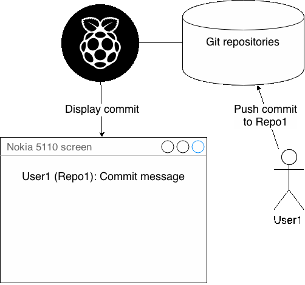

# GitScreen
A project with displaying git hooks in Nokia 5110 screen (via Raspberry Pi)

# Vision
The idea behind this is that whenever something is done to git repository, there's a message displayed in the Nokia 5110 screen. For example:

In this example a user (User1) pushed a commit to a repository (Repo1), which is within Raspberry Pi and the commit message gets displayed in the Nokia 5110 screen.

# Setup
##Hardware
There's a neat [guide by Tony Dicola](https://learn.adafruit.com/nokia-5110-3310-lcd-python-library) of how to setup RPi with Nokia 5110 screen, although if the guide goes offline, the [schematic]("schematics/RPi - Nokia 5110.fzz") is also within the repository.